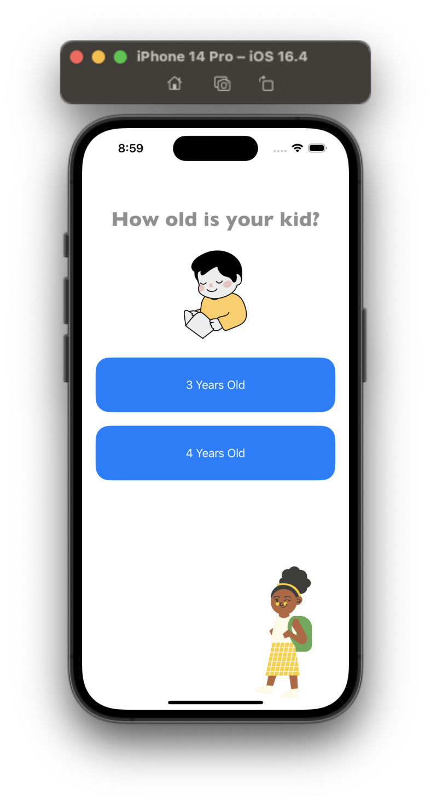
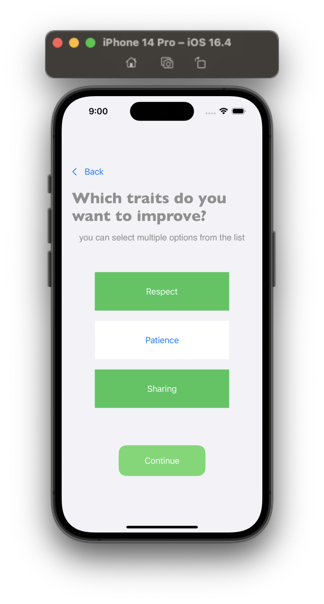
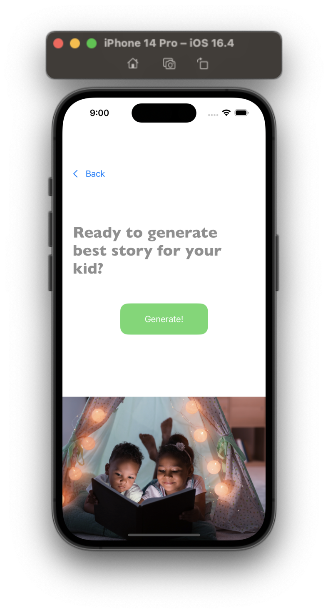
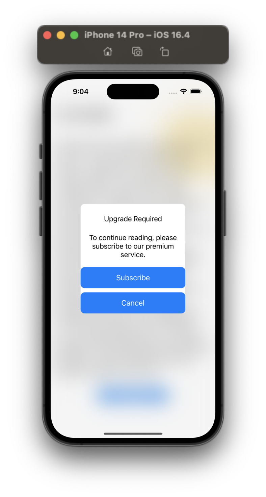

# Story Teller
## Requirements
I have used FireStore to get given stories from database. I added given stories to FireStore database and get the desired story with Firebase API.

So you need to have FireStore package installed on your mac.
You can get help from here -> https://firebase.google.com/docs/ios/setup

## Preview

  
  
  

  
  

